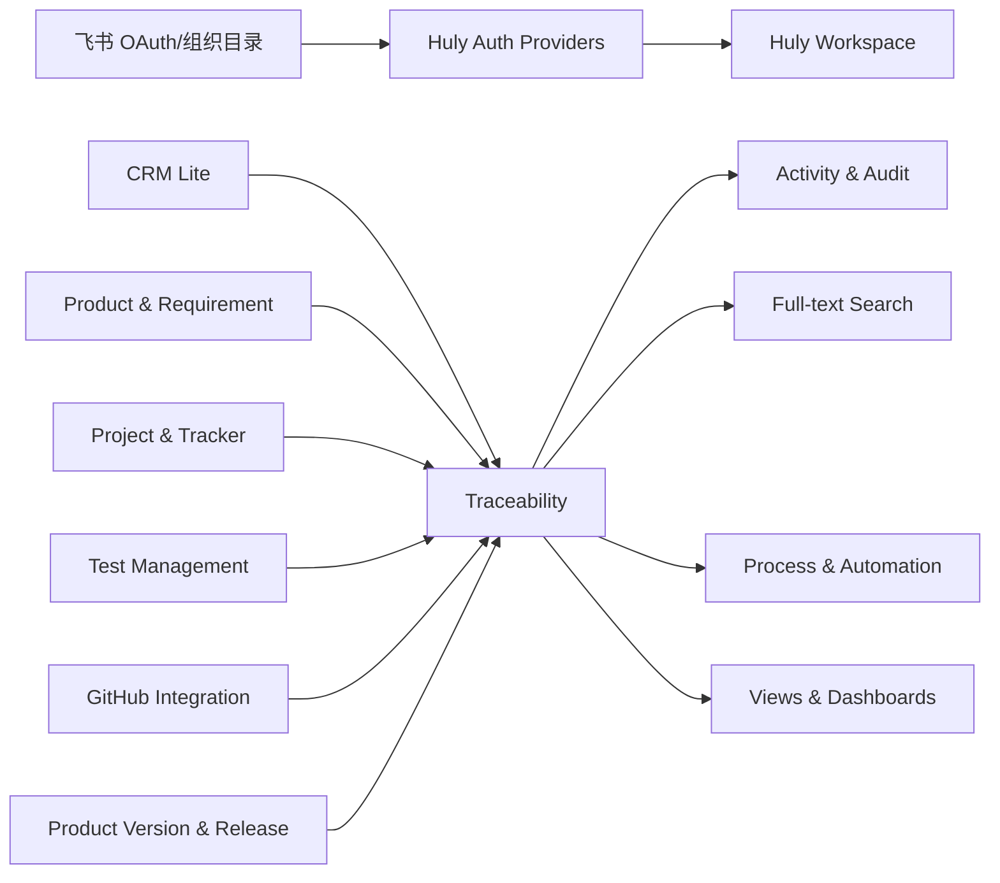

# Huly CRM-ALM 一体化平台设计

| 项目 | 内容 |
| --- | --- |
| 状态 | Final |
| 版本 | 1.0 |
| 日期 | 2026-08-25 |
| 上游 | `hcengineering/platform`，默认分支 `develop` |
| 部署 | 完全自托管；核心代码与部署配置分仓管理 |

## 1. 决策摘要

本项目直接 fork [Huly Platform](https://github.com/hcengineering/platform)，在保持上游可合并的前提下，将客户线索、产品需求、项目执行、测试验证、代码交付和版本发布连接成一个对象图。

核心代码以 `platform` fork 为主；Docker Compose、域名、密钥、备份及镜像编排由 [huly-selfhost](https://github.com/hcengineering/huly-selfhost) 的独立 fork 或部署覆盖层维护。

不恢复 Huly 已逐步弃用的旧 `lead` 模块。新建 `crm-lite` 模块，复用 Contact、Card、Tracker、Products、Test Management、Activity、Notification、Process 和 GitHub 等现有模块。

## 2. 产品边界

首期必须形成以下闭环：

```text
客户/联系人 → 线索 → 需求 → 项目/周期/里程碑 → Issue/Bug
    → 测试用例/计划/执行/结果 → 缺陷 → Branch/Commit/PR/CI
    → 产品版本/发布 → 状态回写到客户、线索和需求
```

“一套系统”定义为：

- 同一域名、工作区、用户、权限和导航；
- 同一搜索、通知、活动记录和审计体系；
- 业务对象之间存在可查询、可授权、可回溯的正式关系；
- 一个对象页面能够查看所有上游来源和下游交付物；
- 不依赖外部 CRM 或测试管理数据库完成主流程。

首期不包含报价、合同、回款、销售预测、客服工单、客户门户和邮件收件箱。

## 3. 竞品研究形成的设计原则

研究结论以 2026-08-25 可见的官方文档、开源仓库和 Huly 上游源码为准。

| 参考产品 | 采用的设计原则 |
| --- | --- |
| [飞书多维表格](https://www.feishu.cn/product/base) | 自定义字段、关联记录、Lookup/公式、表单、多视图、自动化、仪表盘和角色权限 |
| [Linear](https://linear.app/docs/projects) | 快速创建、Triage、项目/周期、里程碑、Issue 关系、客户请求与 GitHub 状态自动化 |
| [Plane](https://docs.plane.so/core-concepts/issues/overview) | Intake、Work Item、Module、Cycle、Saved View、Initiative 和发布管理 |
| [OpenProject](https://github.com/opf/openproject) | 组合管理、WBS、Gantt、依赖、工时、计划与实际进度 |
| [Twenty](https://github.com/twentyhq/twenty) / [Frappe CRM](https://github.com/frappe/crm) | 客户/联系人、线索看板、活动时间线、下一步动作和自定义视图 |
| Huly Test Management / [Kiwi TCMS](https://github.com/kiwitcms/Kiwi) | Suite、Case、Plan、Run、Result、缺陷关联、权限和测试报告 |

不复制竞品页面；只提取已验证的领域模型、交互模式和闭环能力。

## 4. 总体架构



### 4.1 复用上游

- `contact`：Organization、Person、Employee；
- `card`：版本化内容、类型、关系和扩展字段基础；
- `tracker`：Project、Issue、父子任务、组件、里程碑、依赖、估时和工时；
- `products`：Product、Product Version 和发布状态；
- `test-management`：Test Project、Suite、Case、Plan、Run、Result；
- `github`：Issue/PR 等代码仓库对象同步；
- `activity`、`notification`、`view`、`process`、`fulltext`：横向能力。

### 4.2 新增或扩展

- 新增 `crm-lite`：Lead、Pipeline、Source、下一步动作和转换；
- 新增 `requirements`：版本化 Requirement、验收标准、评审和交付摘要；
- 新增 `traceability`：跨模块关系、覆盖率查询和闭环时间线；
- 新增 Feishu OAuth Provider：飞书登录、租户限制、身份绑定；
- 扩展 Tracker：Cycle、Work Item 类型、需求交付视图；
- 扩展 Test Management：结构化步骤、环境/构建、需求覆盖、失败转缺陷和报告；
- 扩展 Products：发布清单和闭环状态汇总；
- 新增基础表单、Saved View、自动化模板和仪表盘。

## 5. 核心数据模型

| 业务概念 | Huly 表达 | 说明 |
| --- | --- | --- |
| Account | `contact.Organization` | UI 显示为“客户” |
| Contact | `contact.Person` | 可关联一个或多个客户 |
| Lead | `card.Card` 的 CRM 类型 | 版本化、可扩展、可建立关系 |
| Requirement | `card.Card` 的需求类型 | 需求正文、验收标准、版本历史 |
| Project | `tracker.Project` | 项目执行空间 |
| Cycle | Tracker 扩展对象 | 固定周期、容量和速度 |
| Milestone | `tracker.Milestone` | 关键交付节点 |
| Work Item | `tracker.Issue` | Requirement/Story/Task/Bug 等类型 |
| Test Suite/Case/Plan/Run/Result | `test-management` 现有对象 | 通过 mixin/新 AttachedDoc 扩展 |
| Repository/PR | `github` 现有对象 | 复用官方同步 |
| Product Version | `products.ProductVersion` | 语义化版本和发布状态 |
| Trace Link | 新增 `traceability.TraceLink` | 跨类有向关系及关系类型 |

Trace Link 的方向固定为 `source --kind--> target`：

| kind | 固定方向 |
| --- | --- |
| `converted-to` | Lead → Requirement |
| `implements` | Work Item → Requirement |
| `blocks` | Work Item → Work Item |
| `verifies` | Test Case → Requirement |
| `defect-of` | Bug → Test Result/Test Case/Requirement |
| `fixed-by` | Bug → Pull Request |
| `delivered-in` | Requirement/Work Item/Bug → Product Version |

反向关系由查询派生，不创建第二条反向 Link。

## 6. 关键流程

### 6.1 飞书登录

浏览器进入 `/auth/feishu`，Provider 生成带防重放状态的授权请求。回调校验状态、租户和身份后，以 `tenant_key + open_id` 为主键绑定 Huly 账号，同时保存 `union_id` 作为跨应用辅助标识。已验证邮箱只用于展示和受控合并，不能单独作为自动绑定依据。

失败时回到登录页并显示可操作错误；系统保留本地超级管理员入口。

### 6.2 线索转需求

销售补齐客户、联系人、问题描述、负责人和下一步动作。产品人员执行“转需求”，选择产品、项目和负责人。服务端使用幂等键创建 Requirement、Trace Link 和 Activity；重复请求返回同一 Requirement。

### 6.3 需求到交付

Requirement 拆分为 Work Item，进入 Cycle/Milestone。Issue 关联 Branch/Commit/PR；PR 合并后按配置推进 Issue，但不得跳过必须通过的测试或发布门禁。

### 6.4 测试和缺陷

Test Case 与 Requirement 建立 `Test Case --verifies--> Requirement` 关系。Test Plan 固定用例版本并绑定 Product Version、Build 和 Environment。失败结果可一键创建 Bug，自动复制复现步骤、实际结果、日志和附件，并建立 `Bug --defect-of--> Test Result`。Bug 修复后进入回归 Run。

### 6.5 发布回写

Product Version 达到发布门禁后变为 Released。系统汇总关联需求、Issue、测试结果、缺陷和 PR，并将发布状态回写到 Requirement、Lead 和 Account 时间线。

## 7. 权限与安全

- 销售：管理客户、联系人和线索；默认不管理项目配置；
- 产品：管理需求、优先级、产品版本和转换；
- 项目经理：管理项目、周期、里程碑、资源和报告；
- 研发：管理 Work Item 和代码关系，按权限查看客户上下文；
- QA：管理测试资产、执行和缺陷；
- 管理员：配置 OAuth、角色、流程、字段和集成；
- Guest：只访问显式授权对象。

敏感字段可以按角色隐藏。所有身份绑定、权限变更、转换、测试结论、发布和外部同步写入审计事件。OAuth 密钥仅从环境变量或 Secret 注入，不存储在工作区文档、日志或 Git 中。

## 8. 一致性与错误处理

- 转换、Webhook 和外部同步必须幂等；
- 外部 API 失败采用指数退避、死信状态和人工重试；
- UI 显示 `pending/synced/failed`，不得静默吞错；
- 删除有引用对象时默认归档；物理删除需要管理员权限和二次确认；
- Trace Link 两端权限独立计算，禁止通过关系泄露无权对象标题或内容；
- Migration 可重复执行，并记录 schema version；
- 上游升级失败时不得部分应用不可逆数据迁移。

## 9. 测试设计

本项目同时覆盖两个维度：

1. 产品内的测试管理能力：Suite、Case、Plan、Run、Result、Coverage、Defect；
2. fork 自身的工程质量：单元、模型迁移、服务集成、OAuth 合同、GitHub 合同、E2E、权限、安全、性能、备份恢复和上游升级冒烟。

详细测试策略和可执行用例见 [QA Test Plan](./2026-08-25-huly-crm-alm-qa-test-plan.md)。

## 10. 交付分期

- V1：飞书登录、轻量 CRM、需求、项目/周期/里程碑、Issue/Bug、测试闭环、GitHub、版本发布和基础报表；
- V1.1：自定义字段、多视图、表单、Lookup/公式和自动化规则；
- V1.2：仪表盘设计器、高级行级权限、项目组合、资源容量和自动化测试结果接入。

详细范围见 [PRD](./2026-08-25-huly-crm-alm-prd.md)，工程约束见 [Technical Spec](./2026-08-25-huly-crm-alm-technical-spec.md)。
